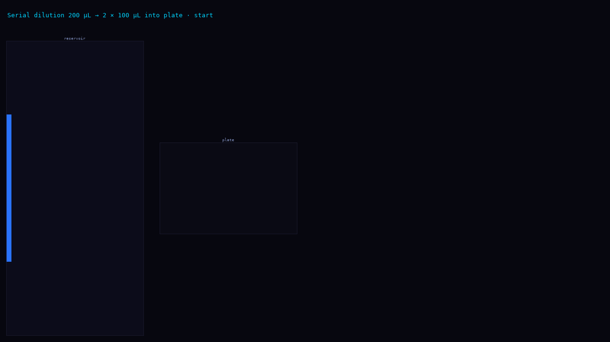
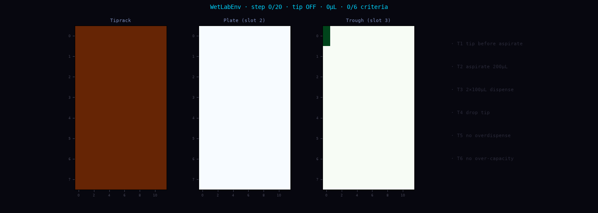
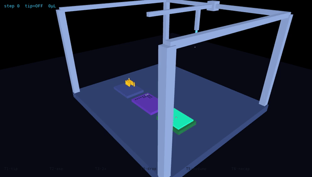
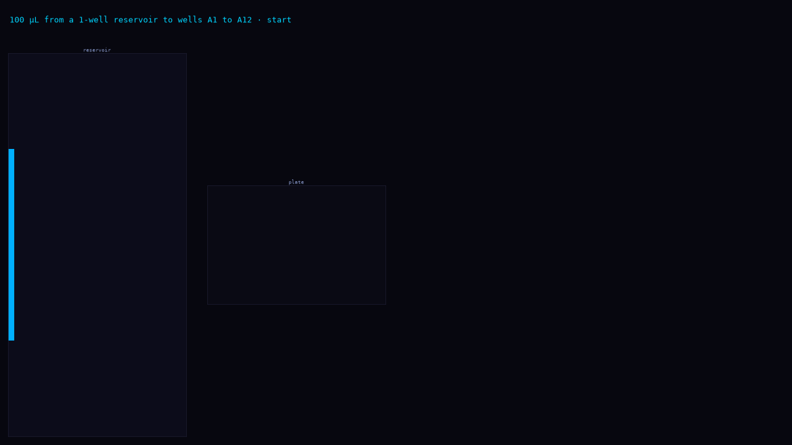
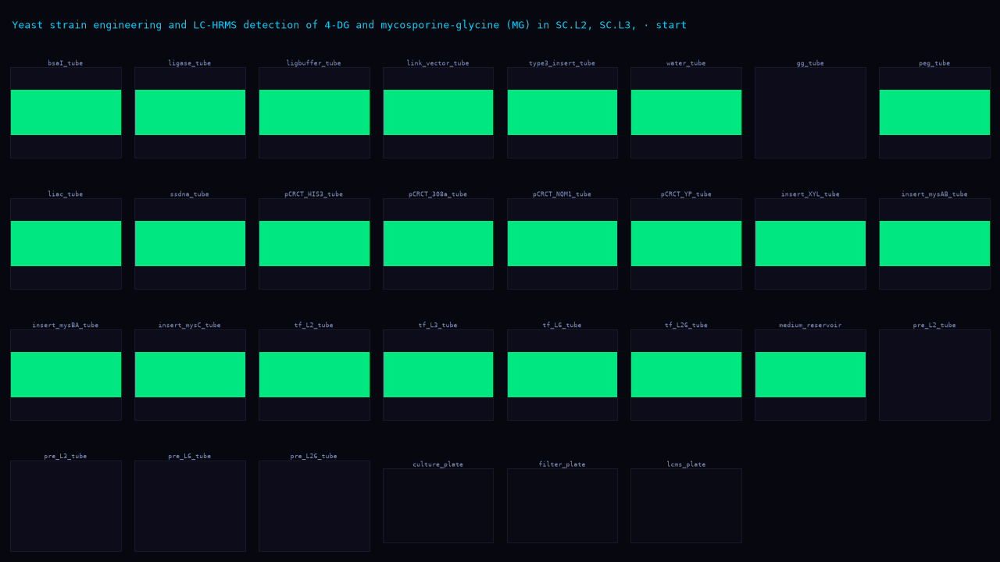
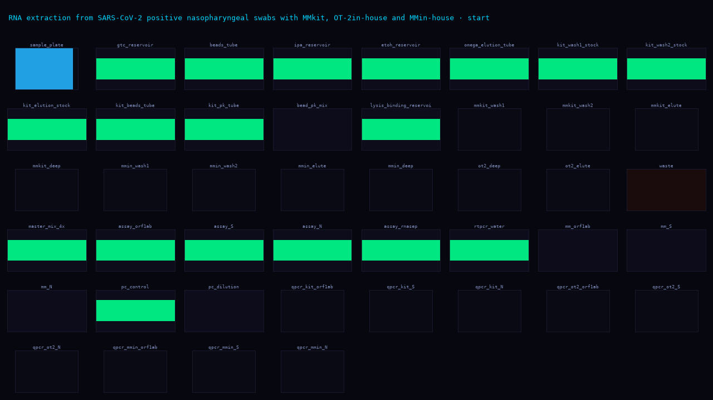
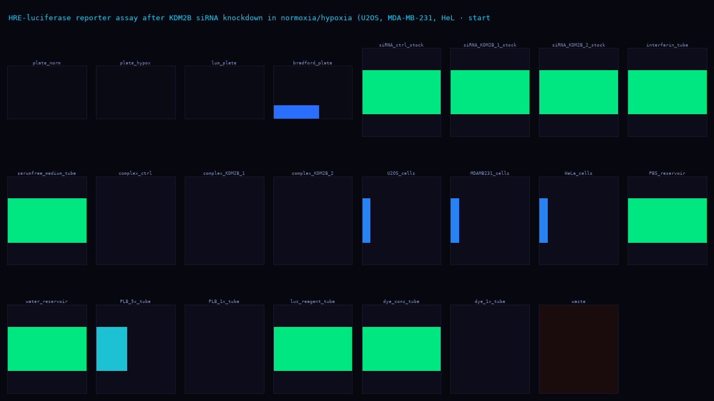
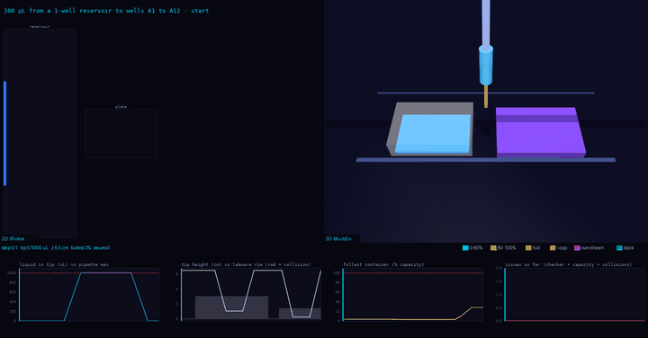
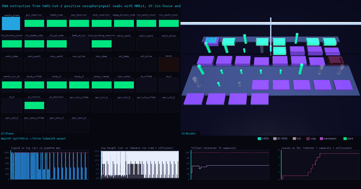

# Examples

Every example is drawn through the same interface. Anything that fits the `Protocol` IR
schema (`paper2protocol/models.py`) renders with one command:

```bash
python eval/ir_viz.py <ir.json> -o out.gif      # one IR
python eval/ir_viz.py --all                     # every tasks/**/ir.json and out/*/exp*/protocol.json
```

One panel per container (96-well plates as 8x12 grids, tubes and reservoirs as bars). Orange
border = source of the step, cyan = destination, red text = the checker flagged the step.
Volumes follow `paper2protocol/check.py`.

Robot-level runs (an `opentrons_simulate` log) go through `eval/trace_replay.py`, which replays
the log through the 2D env, so tip and pipette state show up too.

## L1 - hand-written tasks

### 200 µL into two wells
> "Move 200 microlitres from the reservoir into two wells on the plate."



Robot replay: 

3D: 

### 100 µL into A1-A12
> "Add 100 uL of liquid from a 1-well reservoir to wells A1->A12 in a 96-well plate."



12 x 100 µL is more than one pipette load, so a correct run re-aspirates partway.

Correct run (re-aspirates, 1200 µL ends up in A1-A12):


Bad run (one aspirate, then 12 dispenses). `opentrons_simulate` accepts it silently; the replay
flags `overdispense` and only three wells fill:


## Papers - `paper2protocol` output

| Source | Steps | Containers | View |
|---|---|---|---|
| Yeast engineering + LC-HRMS (bioRxiv 10.1101/2024.09.14.613006, exp 1) | 56 | 30 |  |
| SARS-CoV-2 RNA extraction + RT-qPCR (PLOS ONE 10.1371/journal.pone.0246302, exp 2) | 91 | 44 |  |
| HRE-luciferase assay after KDM2B knockdown (bioRxiv 10.64898/2026.03.26.714448, exp 1) | 53 | 23 |  |

## 3D, side by side with the 2D view

`eval/ir_mujoco.py` builds a MuJoCo scene from any IR and runs it headless: one labware model
per container on a virtual deck (one slot per container, so large decks are bigger than a real
OT-2), a gantry head that lifts, travels, aspirates and dispenses, and liquid levels that follow
the same bookkeeping as the 2D view. Left = 2D IR view, right = 3D.

```bash
python eval/ir_mujoco.py <ir.json> -o out.mp4     # writes out.mp4, out.gif and out_frames.png
python eval/ir_mujoco.py --all                    # -> assets/examples3d/
```

Each example has an MP4, an inline GIF and a PNG contact sheet of 12 evenly spaced frames.
Animation is per IR step: a transfer to many wells is one trip to the first well while all
destination wells fill. Liquid height uses a square root scale so small volumes stay visible.

| Example | Steps | 3D (MP4) | Frames |
|---|---|---|---|
| 200 µL into two wells | 1 | [mp4](../assets/examples3d/L1-example.mp4) | [png](../assets/examples3d/L1-example_frames.png) |
| 100 µL into A1-A12 | 1 | [mp4](../assets/examples3d/L1-a1-a12-100ul.mp4) | [png](../assets/examples3d/L1-a1-a12-100ul_frames.png) |
| Yeast engineering + LC-HRMS | 56 | [mp4](../assets/examples3d/paper-10_1101_2024_09_14_613006-exp1.mp4) | [png](../assets/examples3d/paper-10_1101_2024_09_14_613006-exp1_frames.png) |
| SARS-CoV-2 RNA extraction + RT-qPCR | 91 | [mp4](../assets/examples3d/paper-10_1371_journal_pone_0246302-exp2.mp4) | [png](../assets/examples3d/paper-10_1371_journal_pone_0246302-exp2_frames.png) |
| HRE-luciferase after KDM2B knockdown | 53 | [mp4](../assets/examples3d/paper-10_64898_2026_03_26_714448-exp1.mp4) | [png](../assets/examples3d/paper-10_64898_2026_03_26_714448-exp1_frames.png) |

100 µL into A1-A12:



SARS-CoV-2 RNA extraction (91 steps, 44 containers):



The pipeline is text -> IR -> 3D. For the L1 tasks there is also Python and an Opentrons log
(see above); the paper protocols have no robot code yet, so they go from IR straight to 3D.

## L2 tasks (3D, side by side with 2D)

| Task | Source | 3D (MP4) | Frames |
|---|---|---|---|
| Golden Gate assembly (33 steps) | AssemblyTron paper, `paper2protocol` output | [mp4](../assets/examples3d/L2-golden-gate-assembly.mp4) | [png](../assets/examples3d/L2-golden-gate-assembly_frames.png) |
| E. coli heat-shock transformation | handwritten (APEX), to be replaced | [mp4](../assets/examples3d/L2-ecoli-heat-shock-transformation.mp4) | [png](../assets/examples3d/L2-ecoli-heat-shock-transformation_frames.png) |
| Colony PCR screening | handwritten (Slowpoke), to be replaced | [mp4](../assets/examples3d/L2-colony-pcr-screening.mp4) | [png](../assets/examples3d/L2-colony-pcr-screening_frames.png) |
| AMPure bead cleanup | handwritten, to be replaced | [mp4](../assets/examples3d/L2-ampure-bead-cleanup.mp4) | [png](../assets/examples3d/L2-ampure-bead-cleanup_frames.png) |


## What the IR view does not show
Tips, pipette capacity, deck slots and heights. Those need the robot layer (Python or an
Opentrons log), so use `trace_replay.py` for them.
Manual steps (incubate, centrifuge) appear as a caption only. Mixing does not change volumes.
