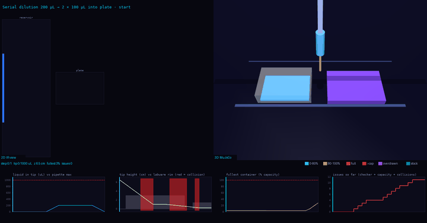

# Examples

Every task and every pipeline output is drawn through the same two viewers. Anything that fits the
`Protocol` IR (`paper2protocol/models.py`) renders with one command.

```bash
python eval/ir_viz.py tasks/a1-a12-100ul/public/ir.json -o out.gif      # 2D
python eval/ir_mujoco.py tasks/a1-a12-100ul/public/ir.json -o out.mp4   # 3D + physics tracking; also writes out.gif and out_frames.png
python eval/ir_viz.py --all && python eval/ir_mujoco.py --all    # every IR -> assets/examples/, assets/examples3d/
```

Each 3D render is a 2D IR view (left), a headless MuJoCo scene (right) and a tracking strip underneath.
Every render, its experiment id and the IR it came from are rows of [`PROVENANCE.csv`](../PROVENANCE.csv).

## Tasks

| Task | Steps | 3D (MP4) | 12 frames |
|---|---:|---|---|
| `split-200ul-two-wells` | 1 | [mp4](../assets/examples3d/split-200ul-two-wells.mp4) | [png](../assets/examples3d/split-200ul-two-wells_frames.png) |
| `a1-a12-100ul` | 1 | [mp4](../assets/examples3d/a1-a12-100ul.mp4) | [png](../assets/examples3d/a1-a12-100ul_frames.png) |
| `ampure-bead-cleanup` | 13 | [mp4](../assets/examples3d/ampure-bead-cleanup.mp4) | [png](../assets/examples3d/ampure-bead-cleanup_frames.png) |
| `colony-pcr-screening` | 4 | [mp4](../assets/examples3d/colony-pcr-screening.mp4) | [png](../assets/examples3d/colony-pcr-screening_frames.png) |
| `ecoli-heat-shock-transformation` | 4 | [mp4](../assets/examples3d/ecoli-heat-shock-transformation.mp4) | [png](../assets/examples3d/ecoli-heat-shock-transformation_frames.png) |
| `golden-gate-assembly` | 33 | [mp4](../assets/examples3d/golden-gate-assembly.mp4) | [png](../assets/examples3d/golden-gate-assembly_frames.png) |

`a1-a12-100ul`: 12 x 100 uL is more than one pipette load, so a correct run re-aspirates partway.


`golden-gate-assembly` (AssemblyTron paper, 33 steps):


## Pipeline outputs

| Paper | Experiment | Steps | Containers | 3D |
|---|---|---:|---:|---|
| DNA-BOT: a low-cost, automated DNA assembly platform for synthetic bio | doi:10.1093/synbio/ysaa010 #exp1 | 34 | 18 | [mp4](../assets/examples3d/paper-10_1093_synbio_ysaa010-exp1.mp4) |
| DNA-BOT: a low-cost, automated DNA assembly platform for synthetic bio | doi:10.1093/synbio/ysaa010 #exp2 | 19 | 11 | [mp4](../assets/examples3d/paper-10_1093_synbio_ysaa010-exp2.mp4) |
| AssemblyTron: flexible automation of DNA assembly with Opentrons OT-2  | doi:10.1093/synbio/ysac032 #exp2 | 33 | 15 | [mp4](../assets/examples3d/paper-10_1093_synbio_ysac032-exp2.mp4) |
| Decoding Specificity of Cyanobacterial MysDs in Mycosporine-Like Amino | doi:10.1101/2024.09.14.613006 #exp1 | 56 | 30 | [mp4](../assets/examples3d/paper-10_1101_2024_09_14_613006-exp1.mp4) |
| BOTany Methods: Accessible Automation for Plant Synthetic Biology | doi:10.1101/2025.08.21.671538 #exp2 | 21 | 11 | [mp4](../assets/examples3d/paper-10_1101_2025_08_21_671538-exp2.mp4) |
| BOTany Methods: Accessible Automation for Plant Synthetic Biology | doi:10.1101/2025.08.21.671538 #exp4 | 49 | 25 | [mp4](../assets/examples3d/paper-10_1101_2025_08_21_671538-exp4.mp4) |
| BOTany Methods: Accessible Automation for Plant Synthetic Biology | doi:10.1101/2025.08.21.671538 #exp5 | 15 | 12 | [mp4](../assets/examples3d/paper-10_1101_2025_08_21_671538-exp5.mp4) |
| Evaluation of two automated low-cost RNA extraction protocols for SARS | doi:10.1371/journal.pone.0246302 #exp2 | 91 | 44 | [mp4](../assets/examples3d/paper-10_1371_journal_pone_0246302-exp2.mp4) |
| Analysis of a Library of Escherichia coli Transporter Knockout Strains | doi:10.3390/antibiotics11081129 #exp1 | 39 | 22 | [mp4](../assets/examples3d/paper-10_3390_antibiotics11081129-exp1.mp4) |
| Analysis of a Library of Escherichia coli Transporter Knockout Strains | doi:10.3390/antibiotics11081129 #exp2 | 46 | 25 | [mp4](../assets/examples3d/paper-10_3390_antibiotics11081129-exp2.mp4) |
| Analysis of a Library of Escherichia coli Transporter Knockout Strains | doi:10.3390/antibiotics11081129 #exp3 | 58 | 17 | [mp4](../assets/examples3d/paper-10_3390_antibiotics11081129-exp3.mp4) |
| KDM2B controls HIF levels and activity through its JmjC and CxxC domai | doi:10.64898/2026.03.26.714448 #exp1 | 53 | 23 | [mp4](../assets/examples3d/paper-10_64898_2026_03_26_714448-exp1.mp4) |


## Colour coding and physics tracking

Liquid is coloured by fill state (volume / capacity), in 2D and 3D:

| Colour | Meaning |
|---|---|
| blue -> teal | filling, under 80% of capacity |
| amber | 80-100% |
| orange | full |
| red | above capacity |
| magenta | overdrawn: more withdrawn than the source held |
| green | stock with ample volume |

The strip plots, per frame: liquid in the tip against the pipette maximum (`--pipette-max`, default P1000), tip
height against the rim of the labware beneath it, the fullest container as % of capacity, and a running issue
count (checker errors, a single dispense larger than the pipette, collisions). The HUD says "needs N aspirations"
when a step moves more than one pipette load.

Collision rule: a lateral move whose tip passes below the rim of labware it crosses. The default animation lifts
first, so it never collides. `--no-lift` drives straight between work heights to show the check firing:

```bash
python eval/ir_mujoco.py tasks/split-200ul-two-wells/public/ir.json --no-lift -o out.mp4
```



## What the views do not show

Tips, pipette capacity beyond the tracking strip, deck slots and heights come from the robot layer, which is
what [`eval/spec_check.py`](../eval/spec_check.py) judges. Manual steps (incubate, centrifuge) appear as a caption.
Mixing does not change volumes. The physics is bookkeeping plus geometry, not fluid dynamics, and collisions are
checked against labware footprints and rim heights only. The 3D deck has one slot per container, so large decks
are bigger than a real OT-2.
