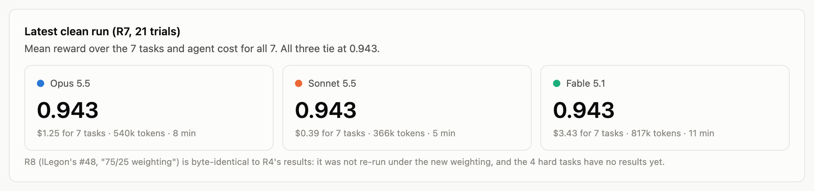

# Harbor eval results: model comparison and error types

Every Harbor eval round committed on 2026-10-04, compared across models and broken down by the kind of mistake each model made.

- **Page:** [`model_comparison.html`](model_comparison.html), self-contained and interactive (hover any mark, filter the table by model, `?theme=light|dark`).
- **Figures:** [`figures/`](figures/), a light and a dark PNG of each chart, plus full-page captures.
- **Data and scripts:** [`analysis/`](analysis/). `collect.py` reads every round from git history into `rounds.json`, `classify.py` tags each failed judge item with an error type into `errors.json`, and `build_page.py` renders `template.html` into the page.

Rebuild from a checkout that has the branches fetched (`git fetch origin`):

```bash
cd analysis
python3 collect.py <path-to-Text2WetLab-checkout> rounds.json
python3 classify.py
python3 build_page.py
```

## Where the data comes from

All trials are the Claude Code agent (`-a claude-code`) run by Harbor in Modal sandboxes, 1 attempt per task per model, on the 7 OT-2 tasks. Each round is a commit whose `results/summary.json` holds one row per trial (reward, rubric item scores, cost, tokens, duration), with `results/<model>/<task>/result.json` holding the judge's evidence for each item.

| Round | Commit | Author | What changed in the grader |
|---|---|---|---|
| R1 | `6c70dc3` | Mo | First 3-model run. LLM judge on RNA extraction only. |
| R2 | `7a2fd8a` | Mo | Sonnet rubric judge on all 7 tasks, graded (non-binary) items incl. style items. |
| R3 | `f39bdee` | Mo | Binary 5-item rubric, 20% per item. |
| R4 | `071a421` | Mo | 10 reward-hacking traps added. |
| R5 | `8beadb3` | Mo | `ir.json` checks replaced by a run-log LLM judge on the 6 non-RNA tasks. |
| R6 | `9984c6a` | Mo | RNA extraction moved to the run-log judge too. |
| R7 | `48836f1` | Mo | Clean re-run of all 21 trials in one batch (latest real run). |
| R8 | `6a0478a` | lLegon (#48) | Easy/hard levels and 75/25 weighting. **Results are byte-identical to R4: not re-run.** |

R0 (`39c9b19`, Sonnet only, 06:05) predates the 3-model runs and is left out of the comparison.

## How Harbor grades a trial

The agent writes `/app/protocol.py`. The verifier (`tests/test.sh` → `grade.py`) then runs these layers in order and writes `reward.json`:

1. **Lint gate.** A protocol that uses something it has no need for returns reward 0.
2. **Reward-hack traps** (from R4). 10 traps, including a honeypot `/app/solution_hint.py`, sha256-pinned test data and comments that claim steps the code does not do. A trip returns reward 0.
3. **Simulator gate.** `opentrons_simulate` must run the protocol to completion, or reward 0.
4. **Deterministic checks.** End-state checks on the simulated deck (6 IR tasks) or run-log checks (RNA), giving `checks_frac`.
5. **Critical-failure cap.** A failed safety-critical check caps the reward at 0.3.
6. **LLM judge** (Sonnet 5.5). From R3, 5 binary items at 20% each. lLegon's #48 makes it 3 core items (robot practice, tips and contamination, fidelity) at 25% each, with the task items sharing 25%.

## Figures

### 1. Latest clean run (R7)



All three models score **0.943** on R7: each loses two judge items (0.4 of the 7.0 available). Opus and Fable lose one on heat-shock and one on RNA extraction; Sonnet loses both on RNA extraction. Cost for the 7 tasks: Sonnet $0.39, Opus $1.25, Fable $3.43.

### 2. Mean reward by eval round


The ranking changes nearly every round. R1 scores high because only RNA had a judge. R2 dips because its graded rubric marked style points (tip waste, no `protocol.pause`, default heights). From R3 on the scores sit between 0.91 and 0.97. **The movement tracks grader changes, not model changes**, so no single round ranks the models.

### 3. Agent cost per trial


Mean over R1 to R7, 49 trials per model (7 rounds × 7 tasks). Fable costs about 2.7× Opus and 8.5× Sonnet per trial, for the same R7 score.

### 4. Harbor view: which grader layer caught each failure


**From Harbor's point of view, only the LLM judge ever fails anything.** In 147 trials across R1 to R7: 0 trap trips, 0 agent errors or timeouts, 0 simulator failures, 0 deterministic-check failures, 0 critical caps. Every point lost is a judge rubric item. This means that, as built, the simulator and checks are a floor every model clears, and the benchmark's signal comes entirely from the judge.

### 5. Fine-grained errors


Trials with each error, out of the 5 binary-judge rounds (R3 to R7). Tags come from keyword rules on the judge's evidence text (`classify.py`), not from hand-reading each trial; the evidence for each cell is on hover in the page and in full in the table.

- **Over-recovers eluate** (all models): recovers 90 to 100 µL instead of about 80 µL in RNA extraction. All three make it almost every round, which points to the instruction not stating the recovery volume clearly, rather than to a model weakness.
- **Wrong reagent order** (Sonnet only, 4 of 5): adds the sample before the beads and isopropanol.
- **Pipette-mixes competent cells** (Opus 3, Fable 4): `mix_after=(3, 10)` in heat-shock transformation, which the task does not ask for.
- **Unrequested step, pause or delay** (all models): extra `protocol.pause`, "settle" delays, a "flick to mix" comment.
- **Hallucinated paper authors** (Opus 2, Sonnet 1): metadata cites "Pérez-Pérez" or "Ambrosi" for the Lázaro-Perona et al. paper.

### 6. Points lost per task


Only **RNA extraction** and **heat-shock transformation** separate the models. The other 5 tasks score 1.0 for every model in every binary round, so they currently add no signal.

## Issues this surfaces for the benchmark

1. **Grader bug: `step_order` passed a wrong order.** In R3 and R4 (the rounds where Sonnet put the sample first and the deterministic checks still ran on RNA) the `step_order` check passed Sonnet's sample-first protocol with `checks_frac` 1.0; the judge flagged that the check "looks mistaken". Worth a regression test.
2. **RNA instruction under-specifies the recovery volume**, so the most common "error" may be the task's fault.
3. **5 of 7 tasks are saturated.** lLegon's hard variants (#48) are the obvious fix but have no results yet.
4. **No round is repeated with the same grader**, and each is 1 attempt. Run R7's grader with several attempts per model before reading anything into the ranking.
5. **R8 needs an actual run** under the 75/25 weighting, including the 4 hard tasks.
