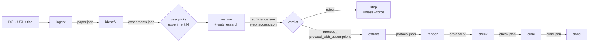

# How the paper2protocol pipeline works

`paper2protocol` turns a published biology paper into numbered, plain-English
liquid-handling instructions (plates, tubes, reservoirs, transfers) that a downstream
parser model can turn into robot code. This document walks through every stage, what each
one reads and writes, and the safeguards around them.

For quick usage see `paper2protocol/README.md`; for the original design rationale see
`docs/superpowers/specs/2026-10-03-paper2protocol-design.md`.

## Overview



| Stage | Module | Input → output | Uses an LLM? |
|---|---|---|---|
| ingest | `ingest.py`, `sources.py` | DOI → `Paper` | no |
| identify | `identify.py` | `Paper` → `list[Experiment]` | yes |
| resolve | `resolve.py` | `Paper`, `Experiment` → `Sufficiency` | yes, with web search/fetch |
| extract | `extract.py` | `Paper`, `Experiment`, resolve findings → `Protocol` | yes |
| render | `render.py` | `Protocol` → numbered text | no |
| check | `check.py` | `Protocol` → `list[CheckIssue]` | no |
| critic | `critic.py` | paper, rendered protocol, check findings → `CriticReport` | yes |

Supporting modules: `llm.py` (the only code that calls Anthropic, plus the response cache),
`guard.py` (leak guard), `models.py` (all Pydantic models), `cli.py` (commands and output
files).

A restricted-research screen between ingest and identify is planned but not built (a `TODO`
in `cli.load_paper`).

## Commands

```bash
uv run paper2protocol search "BOTany plant synthetic biology"   # find a DOI
uv run paper2protocol list    <paper>          # ingest + identify; prints numbered experiments
uv run paper2protocol assess  <paper> -e N     # resolve only: is there enough detail?
uv run paper2protocol convert <paper> -e N     # resolve → extract → render → check → critic
```

`<paper>` can be a bare DOI, a doi.org link, a publisher URL containing a DOI, or a
publisher URL / article id / title without one (looked up in Europe PMC).

| Flag | Effect |
|---|---|
| `--source europepmc\|plos\|biorxiv` | fetch full text from one source only |
| `--xml file.xml` | use a local JATS XML file (e.g. a paywalled paper downloaded by hand) |
| `--refetch` | ignore saved `paper.json` and `experiments.json` and regenerate them |
| `--no-web` | resolve from the model's own knowledge, without web tools |
| `--skip-assess` | skip resolve entirely (convert only) |
| `--force` | convert even when resolve rejects; a warning banner is added to `protocol.txt` |
| `--no-critic` | skip the critic |
| `--cache use\|refresh\|off\|only` | LLM response cache mode (see [Cache](#llm-calls-and-the-cache)) |
| `--out DIR` | output root (default `out/`) |

## Stage by stage

### 1. ingest: DOI → `Paper`

**Resolving the input.** `ingest.normalize_doi` pulls a DOI out of the input with a regex,
strips suffixes like `.full` and `.pdf`, and drops bioRxiv version suffixes (`v2`). If there
is no DOI in the string (e.g. an `academic.oup.com/.../ysaa010/...` URL), `sources.lookup_doi`
extracts the publisher's article id, or uses the text as a title, and searches Europe PMC
for a DOI.

**Fetching full text.** `sources.fetch_jats` tries each source in `SOURCES` that handles
the DOI, in order, and returns JATS XML from the first that succeeds:

1. **Europe PMC**: any DOI. Covers open-access journal articles mirrored in PMC and many
   preprints. Tried first because tables come through as text and there's no rate limiting.
2. **PLOS**: `10.1371/journal.*` DOIs, from journals.plos.org.
3. **bioRxiv**: `10.1101/` and `10.64898/` DOIs, using the latest version's JATS from the
   bioRxiv API.

If none work, the error says so and suggests `--xml`. Paywalled journal articles that
aren't in PMC fail here; a bioRxiv preprint of the same paper is often a workable substitute
(see `out/10.1101_2025.08.21.671538/` for an example).

**Parsing.** `ingest.parse_jats` produces a `Paper`:

- `sections`: every `<sec>` in `<body>` and `<back>`, flattened with stable ids (`s4`,
  `s4.2`, `b1`) and full heading paths (`Methods > PCR setup`). Tables are converted to
  pipe-separated text; image-only tables are marked as unavailable.
- `legends`: figure captions (labels like `Figure 2`). Figures are removed from the body
  first so captions don't pollute section text.
- `references`: citation text plus DOI where JATS provides one.

Saved as `out/<doi>/paper.json` and reused on later runs unless `--refetch` or `--xml`.

### 2. identify: `Paper` → experiments

One LLM call over the whole paper (sections and figure legends, no references). The key
idea is that **Methods subsections are not experiments**: an experiment is a bench workflow
that produces a figure's data, and usually chains several subsections in bench order (e.g.
culture → transfection → treatment → lysis → assay), while one subsection (e.g. cell culture)
can serve several experiments. The model uses the Results text and figure legends to work
out which methods were combined for which figure.

Each `Experiment` has:

| Field | Meaning |
|---|---|
| `title`, `goal` | short name; one sentence on what it measures |
| `section_refs` | section ids whose steps are performed, in bench order |
| `shared_refs` | sections that only supply reagents, recipes or cell lines |
| `unresolved_refs` | methods the paper defers elsewhere ("as previously described", "per manufacturer") |
| `figure_refs` | figure panels it produces |
| `liquid_handling` | `mostly` / `partly` / `little` |

Purely computational analyses and cloning-only steps are excluded. `list` prints the
experiments and marks any figure reference that doesn't match a legend label with `?`
(usually supplementary figures).

**The list is saved and reused.** identify isn't deterministic: two calls can split the
same paper differently. Experiment numbers (`-e N`) and the `expN/` output directories depend
on the list, so `cli.get_experiments` loads `experiments.json` when it exists and only calls
identify again with `--refetch`. This holds even under `--cache refresh`.

### 3. resolve: is there enough detail to run it?

The most expensive stage (typically 1–4 min and around $1 per experiment). One LLM call,
with Anthropic's server-side `web_search` and `web_fetch` tools enabled.

**What the model sees.** The experiment's sections, its shared sections, **every Methods
section** (reagent tables and shared recipes often aren't listed in `shared_refs`; see
`ingest.experiment_section_ids`), the figure legends, and the reference list with
`https://doi.org/…` links so cited methods can be fetched.

**What it's asked to do:**

1. List every detail a technician needs: reagent identities and concentrations, cell
   numbers, volumes, times, temperatures, kit procedures, instrument settings, and any
   deferred method.
2. Check each against the paper.
3. Research each one the paper doesn't give: fetch the cited reference for deferred methods
   (trying PMC / Europe PMC copies if the publisher is paywalled) and the manufacturer's
   manual for every kit. Answering from memory is not allowed when a source can be fetched.
4. Classify every gap:
   - **resolved**: found in the paper's own tables, a cited paper, a kit manual or other
     reliable source (with the URL actually fetched);
   - **assumable**: not found, but a standard-practice default is defensible and wouldn't
     change what the experiment measures;
   - **missing**: not found, and guessing could invalidate the result.
5. Give a verdict: `proceed`, `proceed_with_assumptions` (all gaps resolved or assumable),
   or `reject` (a missing gap undermines the measured outcome).

It also returns `retrieved_details`: every concrete value it recovered, with sources, for
the protocol writer.

**Web limits.** Each call is capped at 8 searches and 10 fetches by default. When a
rejection says research was cut off by the tool limit, rerun with higher caps:

```bash
P2P_WEB_SEARCH_MAX=20 P2P_WEB_FETCH_MAX=25 uv run paper2protocol --cache refresh convert <paper> -e N
```

(`--cache refresh` is needed because the cached rejection would otherwise be replayed;
changing the caps also changes the cache key.) If a rerun with spare quota still rejects,
the missing details genuinely aren't public.

**Outputs.** `expN/sufficiency.json` (verdict, summary, gaps, retrieved details) and
`expN/web_access.json` (every query, listed result and fetched URL, plus leak flags; see
[Leak guard](#leak-guard)). `assess` stops here; `convert` exits on `reject` unless `--force`
is given, in which case `protocol.txt` starts with a warning listing the missing details
that had to be invented.

The resolve findings are formatted by `resolve.details_block` and appended to the extract
and critic prompts, so later stages use what was found and can cite it.

### 4. extract: experiment → `Protocol`

One LLM call that writes a structured protocol. The model sees the same sections as resolve
(without the reference list) plus the resolve findings.

**Container model.** Only these container kinds exist, with working capacities enforced
later by `check`:

| Kind | Capacity per well/tube |
|---|---|
| `plate_96` | 360 µL |
| `plate_96_deep` | 2000 µL |
| `tube_1.5ml` | 1500 µL |
| `tube_15ml` | 15 mL |
| `tube_50ml` | 50 mL |
| `reservoir` | 290 mL |
| `waste` | unlimited |

Dishes, flasks and 6-well plates must be adapted to 96-well format, scaling volumes by
surface area (a 96-well ≈ 0.32 cm²), with each adaptation recorded as an assumption.

**Step model.** Every step is one of:

- `transfer`: move `volume_ul` from a source into **each** destination well/tube. Either one
  source well feeds all destinations, or source and destination lists pair up in order.
  Wells are `A1` or rectangular ranges `A1:H12`; tubes and reservoirs use empty well lists.
- `mix`: pipette-mix a well or tube.
- `manual`: anything that isn't pipetting (incubate, centrifuge, thermocycle, read a plate,
  seal, wait), with all parameters in the action text.

Every reagent drawn must be in `initial_contents` or be produced by an earlier step; bulk
stocks use `volume_ul = null`. Conditions, replicates and controls go on explicit,
non-overlapping wells. Each step carries a `source_quote` (the paper text behind it) and an
`assumed` flag, and the protocol lists every assumption.

Saved as `expN/protocol.json`.

### 5. render: `Protocol` → `protocol.txt`

Deterministic. Writes the deliverable: title, containers, starting contents, numbered steps
("Transfer 297 µL of LB from reservoir to plate1 wells A1:H12 (each well)." /
"MANUAL: Incubate …"), and the assumptions list. Anything assumed is tagged `[assumed]`.

Banners can be prepended: the forced-reject warning (above), and a warning if research
opened a URL the leak guard flagged as possible author code.

### 6. check: volume bookkeeping

Deterministic, no LLM and no deck or tip simulation. `check.check` replays the protocol,
tracking the volume in every well and tube, and reports:

- **errors**: drawing from a well nothing was put into; withdrawing more than a well holds;
  exceeding a container's working capacity; unknown containers; malformed well names;
  source/destination lists that can't pair up; transfers or mixes without a positive volume.
- **warnings**: mix volume larger than the well's contents; manual step with no action.

Stocks (`null` volume) are treated as unlimited; transfers into `waste` aren't tracked. Each
problem is reported once per step. Saved as `expN/check.json`. Overfilled deep-well plates
are the most common real error so far.

### 7. critic: LLM review

Advisory only; nothing is changed automatically. The critic gets the source sections, the
resolve findings, the rendered protocol and the check findings, and looks for missing or
out-of-order steps, numbers that contradict the paper, unreasonable assumptions, well layouts
that miss conditions or controls, and the causes of check errors. It returns a verdict
(`ok` / `minor_issues` / `major_issues`) and per-step issues rated `major` or `minor`, each
with a suggested fix. Saved as `expN/critic.json`.

## Leak guard

The pipeline's output is only meaningful if the protocol is reconstructed from the paper's
text. Many automation papers publish their robot scripts (and often cite the repo in the
Methods), so `guard.py` keeps the model away from them in three layers:

1. **Prompt rule**: resolve is told not to search for, open or use the paper's own code,
   scripts, robot protocols, repositories or supplementary files (cited *other* papers and
   kit manuals are fine).
2. **Domain block**: `github.com`, `githubusercontent.com`, `gitlab.com`, `bitbucket.org` and
   the Opentrons protocol library are blocked in both web tools.
3. **Audit**: every search query, listed result and fetched URL is logged and checked for
   code file extensions (`.py`, `.ipynb`, …), code-hosting sites, and this paper's own
   supplementary files (which are on the publisher's domain and can't be blocked by domain).
   Flags are printed as `!! LEAK FLAG`, stored in `web_access.json`, and an *opened* flagged
   URL adds a warning to `protocol.txt`.

Author scripts kept for scoring live under `ref/` and are never on the pipeline's input
path. Each `ref/*/README.md` records provenance, licence and which script corresponds to
which experiment. Score against them after a run, and don't use them to tune prompts.

## LLM calls and the cache

All model calls go through `llm.structured`:

- **Models.** Each stage's model, effort and token limit are set in `llm.STAGES` (Sonnet 5.5
  throughout by default).
- **Prompt shape.** The paper text goes first and is marked for prompt caching; the
  stage-specific task follows. Output is constrained to the stage's Pydantic schema via
  structured outputs.
- **Server tool loops.** If a web-tool call pauses (`pause_turn`), the request is resent
  with the partial turn, up to 5 times.
- **Failures.** Output that fails schema validation is retried once without the cache. A
  refusal stops the command with a message; hitting `max_tokens` raises an error telling you
  to raise the limit.

**Response cache.** Every response is saved under `.cache/llm/`, keyed on a hash of the exact
request (model, prompts, schema, tools and their limits). Re-running with identical inputs is
free and gives identical output.

| `--cache` | Behaviour |
|---|---|
| `use` (default) | read on hit, call and save on miss |
| `refresh` | always call, overwrite the cached entry |
| `off` | always call, don't save |
| `only` | offline; a miss is an error |

The cache entry stores the full request, so the inputs behind any past result can be
inspected later.

## Output layout

```
out/<doi with / → _>/
├── paper.json           parsed paper (ingest)
├── experiments.json     experiment list (identify); fixes the -e numbering
└── exp<N>/
    ├── sufficiency.json  resolve verdict, gaps, retrieved details
    ├── web_access.json   every search/fetch/result + leak flags
    ├── protocol.json     structured protocol (extract)          ┐
    ├── protocol.txt      the deliverable (render)               │ only if not
    ├── check.json        volume bookkeeping findings            │ rejected
    └── critic.json       LLM review                             ┘
```

## Known limitations

- **Full-text access.** Only Europe PMC, PLOS and bioRxiv are wired in. Paywalled articles
  need a preprint or a hand-downloaded JATS file (`--xml`). PDFs aren't supported.
- **Non-determinism.** identify and resolve can give different answers on reruns. The saved
  `experiments.json` keeps numbering stable, but a resolve rerun with `--cache refresh` may
  change the verdict.
- **Check scope.** check covers volumes only: no deck layout, tip usage, pipette ranges or
  labware compatibility (e.g. an 8-channel pipette working on rows A–F). The critic sometimes
  catches these.
- **The critic is advisory.** There's no automatic revise loop.
- **Single-experiment scope.** Each protocol covers one experiment; workflows the paper
  splits across experiments (e.g. MagBead extraction feeding Golden Gate assembly) are
  converted separately.
- **Restricted-research screen** is not implemented yet.

## Tests

```bash
uv run pytest -q
```

`tests/test_check.py` covers well expansion and the volume checks; `tests/test_guard.py`
covers the leak-guard audit and DOI / article-id parsing. `tests/test_pipeline.py` replays
recorded LLM responses from `tests/fixtures/plos_rna/llm_cache` (PLOS ONE
10.1371/journal.pone.0246302, experiment 2), so it runs offline; it checks `list` + `convert`
end to end and that `convert` stops on a reject. After changing a prompt, schema or model, re-run that paper and refresh the
fixture cache as described in `paper2protocol/README.md`.
