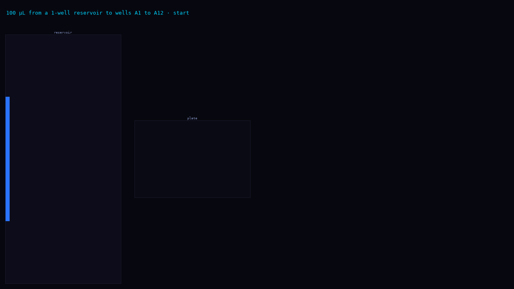
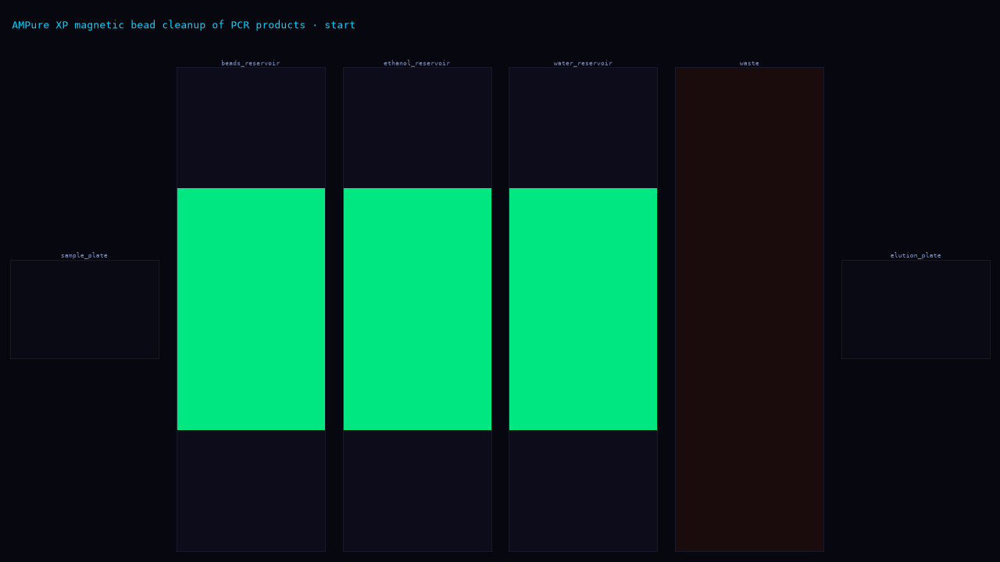
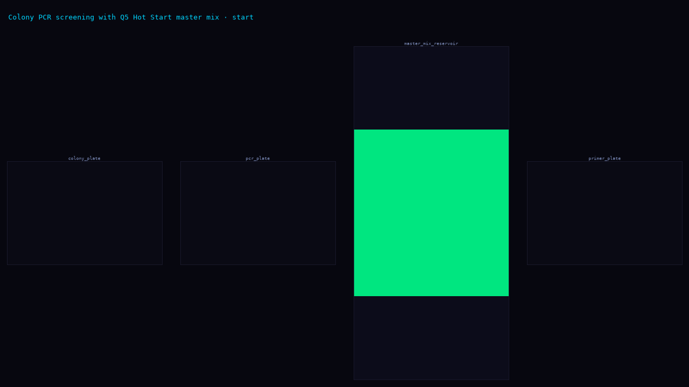
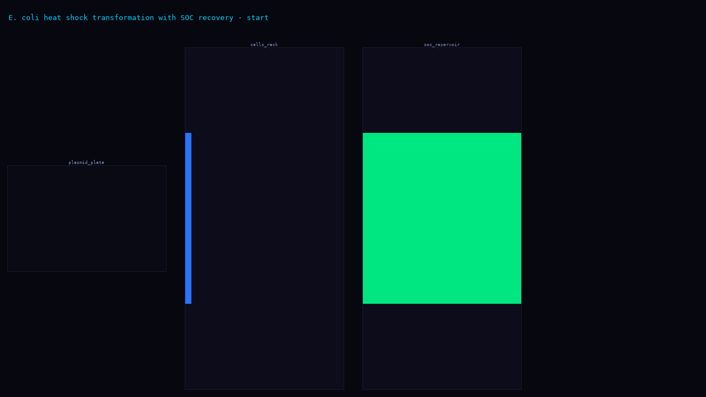
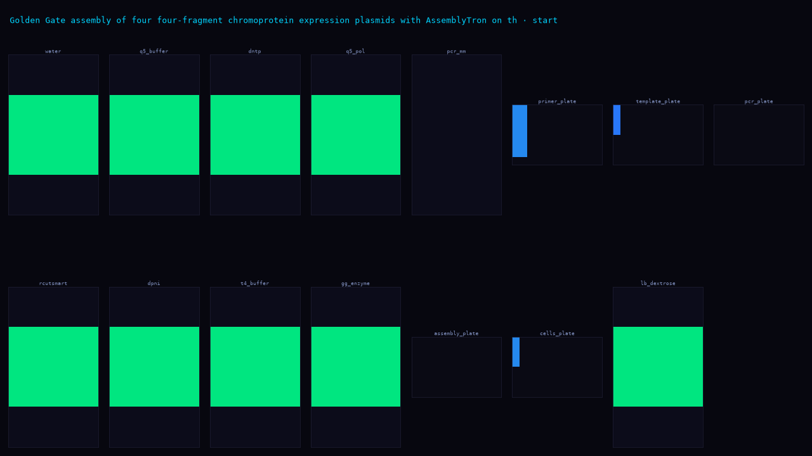
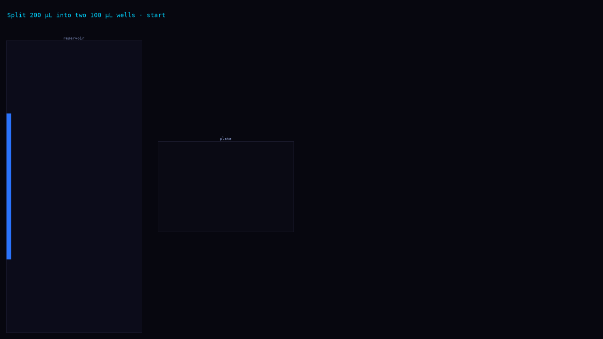
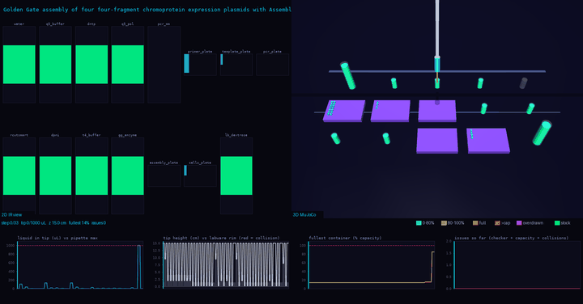
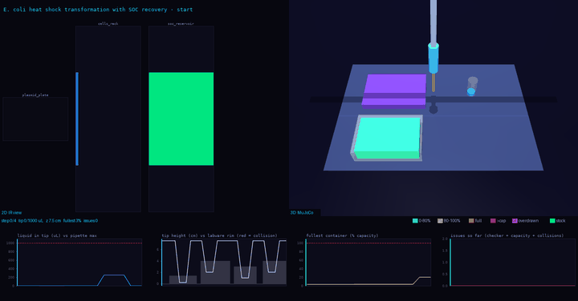

---
language:
- en
license: apache-2.0
task_categories:
- text-generation
- translation
tags:
- biology
- lab-automation
- robotics
- liquid-handling
- opentrons
- benchmark
- wet-lab
- protocol-generation
- claude
pretty_name: Text2WetLab
size_categories:
- n<1K
---

# Text2WetLab

**Natural language → Opentrons OT-2 robot protocol benchmark**

Text2WetLab evaluates whether large language model agents can translate plain-English wet-lab procedure descriptions into correct, safe, executable liquid-handling protocols for the Opentrons OT-2.

[](https://github.com/PhysicalAIBenchmarks/Text2WetLab)
[](https://physicalaibenchmarks.github.io/Text2WetLab/leaderboard.html)

## Reference episode — MuJoCo 3D physics render


## Results (pass@1, 2026-10-04)

3 Claude models evaluated as Claude Code agents in Harbor sandboxes on Modal. All 21 trials passed the Opentrons simulator gate; all deterministic end-state checks passed. Score variation comes entirely from the per-task LLM rubric judge.

| Model | Mean reward | Cost (7 tasks) |
|---|---|---|
| **claude-opus-5-5** | **0.935** | $1.25 |
| claude-sonnet-5-5 | 0.910 | $0.41 |
| claude-fable-5-1 | 0.882 | $3.69 |

### Per-task breakdown

| Task | Opus 5.5 | Sonnet 5.5 | Fable 5.1 | Steps | Source |
|---|---|---|---|---|---|
| `a1-a12-100ul` | 1.000 | 0.917 | 0.833 | 1 | handwritten |
| `split-200ul-two-wells` | 1.000 | 1.000 | 0.917 | 1 | handwritten |
| `ampure-bead-cleanup` | 0.944 | 0.889 | **1.000** | 13 | pioneer-ngs |
| `colony-pcr-screening` | **1.000** | 0.875 | 0.875 | 4 | slowpoke/apex |
| `ecoli-heat-shock-transformation` | 0.714 | **0.857** | 0.714 | 4 | apex |
| `golden-gate-assembly` | **1.000** | **1.000** | **1.000** | 33 | assemblytron |
| `opentrons-rna-extraction` | **0.889** | 0.833 | 0.833 | 48-sample | hulp-rna-extraction |

### Key findings

- **100% simulator pass rate** — all 21 trials passed `opentrons_simulate`; structural correctness is solved for frontier models
- **`robot_practice` is the universal weak point** — penalised in 11/21 trials (52%); encodes tacit wet-lab knowledge not explicit in task specs
- **Phantom mix hallucination** — Opus 5.5 and Fable 5.1 added unrequested `mix_after` to competent cells in the E. coli transformation task (biologically harmful)
- **Dispensing practice only the judge sees**: in colony PCR, every trial passed `no_cross_contamination`. Sonnet 5.5 and Fable 5.1 lost points for running all 96 master-mix dispenses from one tip without contact control, and for default heights on 1 µL additions.
- **The reproducibility gap**: in RNA extraction, all models recovered 100 µL of eluate. The paper says only "collect the supernatant", while the authors' deposited OT-2 script recovers 80 µL. An agent that reads only the paper cannot recover that parameter.
- **Sonnet 5.5 = best cost-efficiency** — 97.3% of Opus 5.5 performance at 33% cost

## Grading

Each task uses a two-layer grader:

1. **Deterministic gate**: `protocol_lint.py` → `opentrons_simulate` → `spec_check.py` (exact labware end-state volume checks)
2. **LLM rubric judge**: `claude-sonnet-5-5` scores 5–9 task-specific rubric items (0 / 0.5 / 1)

Final reward = (deterministic_reward + judge_mean) / 2

Rubric items are task-specific (e.g. `dna_addition`, `heat_shock`, `soc_recovery` for E. coli transformation; `binding`, `washes`, `drying_and_elution` for AMPure cleanup). All tasks share `deck_and_hardware` and `robot_practice`.

## Tasks

One folder per task under `tasks/<task>/`:
- `public/instruction.md` — what the model is given
- `public/ir.json` — the decomposed Protocol IR spec
- `public/assumptions.md` — what the instruction leaves out
- `task.toml` — manifest, source paper, Harbor schema

Oracle protocols and graders are not published (to prevent contamination of future evaluations).

## 2D IR visualisations

Step-by-step liquid tracking from the Protocol IR:

| `a1-a12-100ul` | `ampure-bead-cleanup` | `colony-pcr-screening` |
|---|---|---|
|  |  |  |

| `ecoli-heat-shock-transformation` | `golden-gate-assembly` | `split-200ul-two-wells` |
|---|---|---|
|  |  |  |

## 3D MuJoCo renders

Oracle protocol execution in the opentrons-mujoco-viz physics engine:

| `a1-a12-100ul` | `golden-gate-assembly` | `ecoli-heat-shock-transformation` |
|---|---|---|
|  |  |  |

## Ingestion pipeline

Papers are ingested via `paper2protocol`: PDF/DOI → LLM extraction → Protocol IR → `opentrons_simulate` validation → task. The same pipeline can reproduce any task from its source paper.

## Citation

```bibtex
@misc{oleary2026text2wetlab,
  title  = {Text2WetLab: Benchmarking Large Language Model Agents on Opentrons OT-2 Protocol Generation},
  author = {O'Leary, Niall and O'Leary, Evan and Alshehri, Mohammed and Sturdy, Laurence},
  year   = {2026},
  url    = {https://github.com/PhysicalAIBenchmarks/Text2WetLab}
}
```

## License

Apache 2.0. Source paper PDFs are not redistributed; they are fetched by DOI and verified by SHA-256. See `PROVENANCE.csv`.
