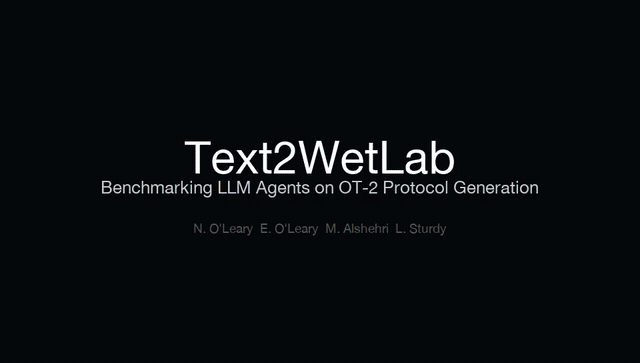

---
language:
- en
license: mit
task_categories:
- text-generation
tags:
- biology
- lab-automation
- robotics
- liquid-handling
- opentrons
- benchmark
- wet-lab
- protocol-generation
- agents
pretty_name: Text2WetLab
size_categories:
- n<1K
---

# Text2WetLab

**Benchmarking LLM agents on turning lab protocols and papers into Opentrons OT-2 robot code.**

Code that passes the vendor simulator can still ruin an experiment: it can pipette-mix fragile cells, carry beads into
an eluate, or draw more from a reservoir than it holds. Text2WetLab grades whether an agent's protocol does what the
protocol or paper says. It has 11 tasks in the [Harbor](https://github.com/harbor-framework/harbor) format at two levels:
*easy* tasks give the exact steps; *hard* tasks give only a goal, a fixed deck and the source paper.

[Preprint](https://physicalaibenchmarks.github.io/Text2WetLab/docs/preprint/preprint.html) ·
[Leaderboard](https://physicalaibenchmarks.github.io/Text2WetLab/leaderboard.html) ·
[GitHub](https://github.com/PhysicalAIBenchmarks/Text2WetLab) ·
[All links](https://github.com/PhysicalAIBenchmarks/Text2WetLab/blob/main/docs/urls.md)



## Results

<!-- RESULTS -->

Refused tasks are not scored: a refusal is the provider's safety policy, not a protocol. Models are ranked on the
tasks every model answered; Opus 5.5 and Fable 5.1 refused some standard cloning prompts (Anthropic's biosecurity
filter), and those are reported, not scored. No model failed the simulator or a reward-hacking trap; the points are
lost to the rubric, mostly for inventing steps or quantities that the paper does not support.

## What is in this dataset

What an agent is given, for all 11 tasks:

- `tasks/<task>/instruction.md`: the brief: fixed deck, starting contents, and the steps (easy) or a goal and the
  source paper (hard).
- `tasks/<task>/task.toml`: Harbor manifest, source papers, metadata.
- `tasks/<task>/public/`: for the easy tasks built from a protocol IR, the IR (`ir.json`) and what the instruction
  leaves out (`assumptions.md`).
- `sources/`: one record per source paper (48), with `master.csv`; papers are linked by DOI and checked by SHA-256,
  never redistributed.
- `eval/`, `assets/`, `docs/`, `manuscript/`: simulator and renderer code, visualisations, documentation, the preprint
  source.

Not in this dataset: the graders, ground truth checks, rubrics and reference solutions (`tests/`, `solution/`), the task
containers (`environment/`), third-party author code, and paper PDFs. This copy mirrors that allowlist on every deploy
from `main`. To run the benchmark, clone the GitHub repository and use Harbor.

## Grading

A layered verifier: a lint gate, 10 reward-hacking traps, the Opentrons 7.5 simulator, deterministic checks of the
simulated run against the ground truth (labware, every end-state volume, tip use, contamination, reservoir capacity),
then a pass/fail rubric scored by an LLM judge as the majority of three calls. Three core items (robot practice, tips
and contamination, fidelity to the task or paper) carry 75% of the reward; task items share the rest. A failed critical
check caps the reward at 0.3. All 11 reference solutions pass; 152 broken or cheating protocols all fail.

## Citation

```bibtex
@misc{text2wetlab2026,
  title  = {Text2WetLab: Benchmarking LLM Agents on Turning Lab Protocols and Papers into Robot Code},
  author = {O'Leary, Evan and Alshehri, Mohammed and Legon, Laurence},
  year   = {2026},
  url    = {https://github.com/PhysicalAIBenchmarks/Text2WetLab}
}
```

## Licence

MIT for the code and task files. Paper text and third-party code keep their own licences and are not redistributed
here.
