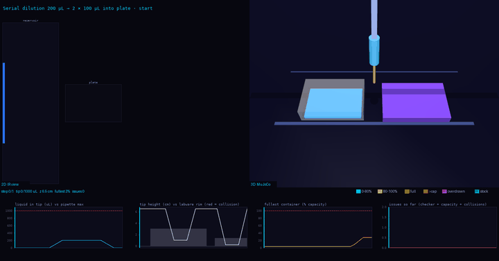

---
language:
- en
license: apache-2.0
task_categories:
- text-generation
- translation
tags:
- biology
- lab-automation
- robotics
- liquid-handling
- opentrons
- benchmark
pretty_name: Text2WetLab
size_categories:
- n<1K
---

# Text2WetLab

**Plain-English lab instruction -> Opentrons OT-2 protocol, judged on what the simulated robot does.**

Given an instruction, a model writes an Opentrons Python protocol. The protocol is simulated on Opentrons 7.5.0 and
judged on its end state and on generic safety rules, not on how it is written: `transfer()`, `distribute()` and explicit
loops all pass if the plate ends up right.

## Tasks

One folder per task under `tasks/<task>/`: `instruction.md` (what the model is given), `ir.json` (the decomposed spec),
`assumptions.md` (what the instruction leaves out), `task.toml`. Hidden oracles and graders are not published.

| Task | Steps | Source |
|---|---:|---|
| `split-200ul-two-wells` | 1 | handwritten |
| `a1-a12-100ul` | 1 | handwritten |
| `ampure-bead-cleanup` | 13 | handwritten |
| `colony-pcr-screening` | 4 | handwritten |
| `ecoli-heat-shock-transformation` | 4 | handwritten |
| `golden-gate-assembly` | 33 | paper2protocol (AssemblyTron) |
| `opentrons-rna-extraction` | n/a | Harbor task (PLOS ONE 2021) |

## Instruction vagueness

How much the wording leaves out, independent of the task.

| Level | Example |
|---|---|
| V0 (fully specified) | "Add 100 uL of liquid from a 1-well reservoir to wells A1->A12 in a 96-well plate." |
| V1 (volume only) | "Move 200 microlitres from the reservoir into two wells on the plate." |
| V2 (intent only) | "Aliquot the reagent into two wells." |

## What is judged

Simulator gate, generic rules (tip before aspirate, no overdispense, no draw from an empty well, tip dropped) and an
end state derived from the IR. See `docs/criteria.md` for the evidence: 21 deliberately broken or alternative
protocols, 0 misjudged.

## Ingestion master table

`ingestion/master.csv` has one row per (paper, experiment): 113 rows for 36 papers, with the PDF (URL, SHA-256, pages, licence,
whether it may be redistributed), the codebase (repo, pinned commit, licence, Opentrons script counts, whether it simulates), the
pipeline state of each experiment and its link to a benchmark task. PDFs and third-party code are not in this dataset; the table
records where to fetch them and how to verify them.

## Provenance

`PROVENANCE.csv` lists who first committed every task, reference, pipeline output, render and code file, with URLs.

## Reference episode



## Citation

```bibtex
@misc{text2wetlab2026,
  title  = {Text2WetLab: A Benchmark for Natural Language to Wet Lab Protocol Translation},
  year   = {2026},
  url    = {https://github.com/PhysicalAIBenchmarks/Text2WetLab}
}
```
